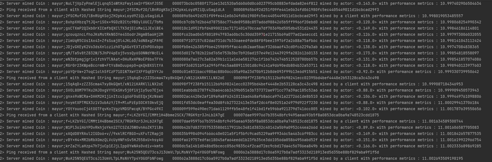
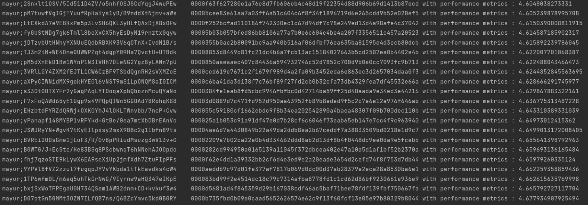
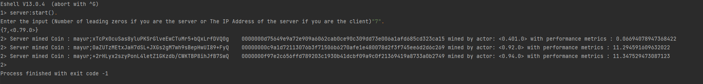

# SecureHash
DOSP Project 1.

Group members - 

1) Mayur Reddy Junnuthula (UFID - 36921238)
2) Akhil Srivatsa (UFID - 80826297)

Project Description -

Bitcoins (seehttp://en.wikipedia.org/wiki/Bitcoin) are the most popular crypto-currency in common use. At their heart, bitcoins use the hardness of cryptographic hashing (for a reference seehttp://en.wikipedia.org/wiki/Cryptographichashfunction)to ensure a limited “supply” of coins.  In particular, the key component in a bit-coin is an input that, when “hashed” produces an output smaller than a target value.  In practice, the comparison values have leading  0’s, thus the bitcoin is required to have a given number of leading 0’s (to ensure 3 leading 0’s, you look for hashes smaller than0x001000... or smaller or equal to 0x000ff....The hash you are required to use is SHA-256.  You can check your version against this online hasher:http://www.xorbin.com/tools/sha256-hash-calculator. For example, when the text “COP5615 is a boring class” is hashed, the value fb4431b6a2df71b6cbad961e08fa06ee6fff47e3bc14e977f4b2ea57caee48a4 is obtained.  For the coins, you find, check your answer with this calculator to ensure correctness. The goal of this first project is to use Erlang and the Actor Model to build a good solution to this problem that runs well on multi-core machines.

**Steps to run the project** - 

1)  Build the project and run it using the erlang console run configuration in IntelliJ IDEA with just default (zero) arguments and default settings.
2) Start the server with the command server:start() in the erlang console, the input format is different for server and client machines / instances as stated below.
3) Enter the number of leading zeros which should be present in the hash string for mining. (for Server machine)
4) This will start the master/server and will start mining the coins in the server.
5) Enter the server’s IP address where the master program is running. (for Client(s) machine)
6) This will start the slave/client and will start mining the coins and sends the output to the server whenever a valid coin is found.

**Input Format** - 

The input format is a number or an IP Address enclosed within double quotes.
For example, Input for server - "4", Input for client - "127.0.0.1".(The Ip Address of server)

**Working** - 

**Server**

Once the user starts the application, the server spawns the parent process while waiting for a TCP 
connection by listening to a port specified in the program. The parent process then spawns several
child processes and distributes the work between them as and when the child finishes its work and 
is available for the next task. When a child process finishes its work, it reports back to the
parent process the output hash string and then the parent assigns new work to the child. With
this local parallelism is achieved. The parent acts as a supervisor and is also responsible
for restarting the child when it fails. Currently the no of processes spawned in each child
actor is Number of Cores * 32 as after exhaustive testing we concluded that the performance in converging for around
32 processes per core, with no further significant improvement. 

**Client**

Once the user starts the application by entering the IP address of the server, the client 
notifies the server that its available by sending a connection request to the server to which t
he server acknowledges the request by establishing the connection and responding back with the 
number of leading zeros. Then the client executes it’s own parent process which is the same program
as the server and returns the output back to the server where it gets printed. The aggregate output is
printed by the server/master.

**Note** - There can be multiple clients which can be connected to a server, and multiple 
instances of the application running inside the client which can be connected to different 
servers. Also, in our system the server and worker program are installed/present in all the systems involved in the distributed system architecture.

**Project Structure**-

1) Server.erl 

- start(): 
Responsible for taking the user input. Depending on the user input, it calls the parent actor to start mining. It's also
responsible for opening a TCP connection port which will be active for an infinite period of time. 

- handler():
 Responsible for acknowledging all client connection requests and output strings returned by the client.

- print_output_events(): 
  Responsible for printing the output strings mined by both client and server.

2) Worker.erl

- parent_actor(): 
 Acts as a supervisor and is responsible for spawning child actors. Responsible for assigning work to the child whenever the child
 finishes its work.

- spawn_child_actors():
 The child actors are mined here.

- mine_coins():
The mining logic of the program is present here.

Project ReadMe Questions/Tasks: 
1. Size of the work unit that you determined results in the best performance for your implementation and an explanation of how you determined it. The size of the work unit refers to the number of sub-problems that a worker gets in a single request from the boss. 

   **Ans**. In our system, each worker is assigned a task of mining. The worker then spawns several parallel processes to perform mining. 
    As far as the no. of parallel processes are concerned, currently the no. of processes spawned in each worker
    is Number of Cores * 32 as after exhaustive testing we concluded that the performance in converging at around
   32 processes per core, with no further significant improvement. The reason being, we have one parent actor that acts as a supervisor and is responsible for assigning the work to its children. Whenever,
    a child finishes its work(finds a matching coin), it reports back to the parent. The parent then assigns new work to the child. Adding more no.of child actors would lead to more no.of 
  of messages in the parent's message queue. Since the parent works at its own pace, the no.of  messages in the queue would pile up and this will lead to the child actors sitting idle
  resulting in improper CPU utilization.

2. The result of running your program for input 4

**Ans**.

**Server Side**

Eshell V13.0.4  (abort with ^G)

1> server:start().

Enter the input (Number of leading zeros if you are the server or The IP Address of the server if you are the client)

"4".

{4,<0.79.0>}

2> Server mined Coin : mayur;2RkKtozlCXknP7MLiUQcry83o+pW5+s8rKjUjFKou48    0000b51a1bf99ac32c3ff701a61cb563ddb9c93657e865dd23dc7b730bf764f5 mined by actor: <0.127.0> with performance metrics : 2.631368059530624

2> Server mined Coin : mayur;NLzOmq0eYi8n6YXaq0qNxxewsxFT7fjr+i6nW4Nz3ms    00007944540dce45e41ff7b7c8bf21076f8388c7d9f44175b2937fa9ecbb8054 mined by actor: <0.145.0> with performance metrics : 2.647320918542214

2> Server mined Coin : mayur;QUdiyoVGHXHOXi7EmeLfjv2sF81gsu3bZVZ2/vA3Uro    00001fab6d0671ebc334528ca7dd82242ec6bceb28ed7b3105243f9ea4e60265 mined by actor: <0.101.0> with performance metrics : 2.697772220959309

2> Server mined Coin : mayur;hIE9eZJNardNrV4LZBuSC9Iy2uceYfy0XE1mSZKeDYg    0000b08cafb7f9646569d11bc1372c5ba5c90b8152b7c0d3ffcf3501e5dad792 mined by actor: <0.94.0> with performance metrics : 2.7472862957937583

2> Server mined Coin : mayur;h0IB4MS98TvDymcEHWeolmRHV2rf1Ku0tDcfNhACSDY    0000272cc1ec51a8f4b183fa96863d8b147f349ad906872374e2a5b055bc9db0 mined by actor: <0.85.0> with performance metrics : 2.7444933920704844

2> Server mined Coin : mayur;+vugyBJlZ+O0StwjYTqn7IEOUA1+s/NvwdhrvmiN4TY    00002832b20f6325e5c1c210a4f79369664b1fc44485fe34183674358732dc72 mined by actor: <0.115.0> with performance metrics : 2.7441834199231985

2> Server mined Coin : mayur;OefSCql4Pfn84GZIRtz3eWCaoQsHSDAwVUp3GI6EWXE    0000a29dedc2d14c5a751d554dcbb13e472f88182874e7a3bd1a47ea8412ca13 mined by actor: <0.136.0> with performance metrics : 2.743563685636856

2> Server mined Coin : mayur;WzFLkwFdOZBF8Gxrxuaqki8zJ5tfVh87Pcy/Zdrv0E8    0000343653757ef4f473ccedc5577402ae6a157bf4c1a086799bf6dfc6b4348b mined by actor: <0.170.0> with performance metrics : 2.8720062381641975

2> Server mined Coin : mayur;0E3R6Ccwr+QAHVG/Bdrl0mcxH9n+907+QADhEBVZNAk    000005c7a37bbf58a830c767fe1d99f0d310532cf5a2b116d69314a52ae7b71c mined by actor: <0.120.0> with performance metrics : 2.9170271769273435

2> Server mined Coin : mayur;hYF4Z4UaNOedNV9Ju/XAZjKZPNzwYQ9aj0N4jvOSDXo    00007d7e0fa2a3dcb6f2328dd6911630edbcf80f7e1fc93270056ba21f28c00c mined by actor: <0.166.0> with performance metrics : 3.011421041071821

2> Server mined Coin : mayur;SfVJQGktVuE3q8JETqlsDlbG0KzCKlhBa01L0rNW/0Q    0000e2849704b6edfba0e5665a61ef0539277a536b82ced85f92dce42b9013c1 mined by actor: <0.136.0> with performance metrics : 3.022441160372195

2> Server mined Coin : mayur;RDfM6wo7yOJGYWGIdkGXglVVXt2wABdV/mgMhiOl5Vw    000013208f20acdac4d00be10f12d35dabc582694b957bef203107bfa3c522cc mined by actor: <0.154.0> with performance metrics : 3.070517711171662

         |
         |  so on.....
         |

2> Server mined Coin : mayur;y0OZVvS6S7MgOSQJuzF993gNGFEq0DFJiXARQBV9RDs    0000e81b702a1d7a8f1c03ea1fd31375bbfaa4f3a299c5db2547941b79ad69f5 mined by a client with performance metrics : 10.996609003341852

2> Server mined Coin : mayur;TuTC3DtQi3/pt5ccyCQ2MsYikfWQ8XJVBSsmhZXBeO8    0000965492b8f945133609cc4a94ac8c6b7fdda97bfff635ac1667806611165e mined by actor: <0.121.0> with performance metrics : 10.995704630156023

2> Server mined Coin : mayur;fXUzMLcItHvaeM68QpXn5w3KW1j7ioHYkeQ7cJwHQvw    0000d32262e529e5121720b6a943692ffb7f02a7ba70e14bde9544daa75d50c1 mined by actor: <0.175.0> with performance metrics : 10.996338281096552

2> Server mined Coin : mayur;8CAJZCcu022HGMkSVvc+FiRfTQrCgw5Q+R+gW9dTQiM    000080735768a442dc44161147d3d6cc2c795a5b944680f5936a7c75a326f330 mined by actor: <0.92.0> with performance metrics : 10.99639520857295

2> Ping received from a client with Hashed String mayur;+Vhm+nA6Pmnv07NXrQlomk1Ey7DOUr/t0MELgadNlqU    00007f4607efe9a9b84fc9b0ba21bae62267486554ae7113858d4c964e17dcfc

2> Server mined Coin : mayur;+Vhm+nA6Pmnv07NXrQlomk1Ey7DOUr/t0MELgadNlqU    00007f4607efe9a9b84fc9b0ba21bae62267486554ae7113858d4c964e17dcfc mined by a client with performance metrics : 10.997292975763017

2> Server mined Coin : mayur;COoBRsCXNjiGnLaMJcQh3T4SHq18LAbqxMjO79oRDIw    00004ba6b10ee6afb1365fc5bfe552f453f14266669f785ffeb69d342118fe91 mined by actor: <0.137.0> with performance metrics : 10.996255810855343

2> Ping received from a client with Hashed String mayur;uO9X02JhaG9li4YlCsaeHWXhoyU0NpZVL7Hs9ousnzc    0000cb6d2837d09b5486031b8e385fb14d2fabc0f53263ef5466bddb3d0d6e8e

2> Server mined Coin : mayur;uO9X02JhaG9li4YlCsaeHWXhoyU0NpZVL7Hs9ousnzc    0000cb6d2837d09b5486031b8e385fb14d2fabc0f53263ef5466bddb3d0d6e8e mined by a client with performance metrics : 10.996893996227923

2> Server mined Coin : mayur;qI/I/hxydCkJAAe9nkk2TfDuvsKgRadlXDxbuSyKus0    000089a18174a4d755f9b1de880c332942c8f6eb8d592143b2a1eb36365ecb3e mined by actor: <0.153.0> with performance metrics : 10.99683122782911

2> Server mined Coin : mayur;cOk96Bm5xdCVnbDmYylgQxkgDPiQdbZglGtEEzaBq4k    0000cd9ebd2f36c196657c59e927dca01c4beff2b22794db604fddf8e4934328 mined by actor: <0.114.0> with performance metrics : 10.996672784074194

2> Ping received from a client with Hashed String mayur;JC1baxzea2NchLwcEz63pJwcaLqxUOfpRLthtgJOvhk    000049d41d4d322e9089354e1ae48d76fc778dd641e17664f983a1d5de77beed

2> Server mined Coin : mayur;JC1baxzea2NchLwcEz63pJwcaLqxUOfpRLthtgJOvhk    000049d41d4d322e9089354e1ae48d76fc778dd641e17664f983a1d5de77beed mined by a client with performance metrics : 10.99790561980345

2> Ping received from a client with Hashed String mayur;3O1PlX1j6ij1Zhs7glLrd51m7aev6i3yThXJV0KT14s    0000efbd16a3a866a4b4c0cae4a3981bcaac56f3f3cad1608f646bd0c2602228

2> Server mined Coin : mayur;3O1PlX1j6ij1Zhs7glLrd51m7aev6i3yThXJV0KT14s    0000efbd16a3a866a4b4c0cae4a3981bcaac56f3f3cad1608f646bd0c2602228 mined by a client with performance metrics : 10.996904241609235

2> Server mined Coin : mayur;awYZ3dz/faZHhhguIv32g2AuUoUQ9beQoXLuGs7xiEM    0000116bd66fdf7cc37fe9ff0d37d979d738e23b73b65081cd5bd503a5258e3e mined by actor: <0.142.0> with performance metrics : 10.99791312142412

2> Server mined Coin : mayur;NuLTjVpZyPnwlEjLqnq5I4WtHzFwy1sw2rf5KnfJS5E    000073bcbc0580f1716e13d1520a5d6060d0c6023795cb0883efdada82e4f812 mined by actor: <0.143.0> with performance metrics : 10.997402906504634

2> Ping received from a client with Hashed String mayur;2fSCMuf2O/lBnRUgKSojZH2pkxLoyd9ZiQLuSagidLA    00008965b492d251f09fe441e0634fd061980fc5ec4405449011d1bcbcad29f3

2> Server mined Coin : mayur;2fSCMuf2O/lBnRUgKSojZH2pkxLoyd9ZiQLuSagidLA    00008965b492d251f09fe441e0634fd061980fc5ec4405449011d1bcbcad29f3 mined by a client with performance metrics : 10.998019053485557

2> Server mined Coin : mayur;BxhpXHbzq7tJQ+riSOx+9GDzB2Ctc9BDylUUCI/7bMs    0000cb7c0b7d2b64d787586c774de89588c857ad6d9884265b5ff9966f20ebd0 mined by actor: <0.120.0> with performance metrics : 10.998068254990342

2> Server mined Coin : mayur;gsCTXmP2QIkb0rXICmfbQXCl7X3djECoMei1JEslBE4    000010c1d952fbfd4890021bc7171401470ccaa7df70369bd505db4531d24435 mined by actor: <0.149.0> with performance metrics : 10.99846186114801

2> Server mined Coin : mayur;qzouqzncLfhoJKsMstRkN03Ye4SOodrJHgmB5a6Hj2M    0000fc62bad045f8018947f83a60bc5c30dd35971e21715b69a077ad2a4eccd1 mined by actor: <0.126.0> with performance metrics : 10.997973006032055

2> Server mined Coin : mayur;ZimUqR5CUsIAx43+ZfsSuaj0l4JKL6D/4dN8xgCPA9E    000087f107157c82da6731dc7b336aeedfde88f8fbee15976f2a2688a75afb6c mined by actor: <0.118.0> with performance metrics : 10.998141043112424

2> Server mined Coin : mayur;JDjvGKEyK2Vo3dsXnlczizh07gAGoYEXTzEhP0Xxbpo    0000fb0e426385f96e4259895ffac4cdb2aae5bacf32d6a6f43cd0fc6229a3ab mined by actor: <0.138.0> with performance metrics : 10.99747084838365

2> Server mined Coin : mayur;qM/Ta5v8tZ832W/5JhPV4pEoj5vssQy6S0NWdYWcEL4    00003d017e782b226d765e753b3bc7b920ad157e49e12443929fa28261260133 mined by actor: <0.173.0> with performance metrics : 10.99854818558097

2> Server mined Coin : mayur;wN3btpmgjgr1v1fzhV7lNAat+0HuRxHPWoEP8bxTFYk    0000080a7a627c3a82a39b1c11a1e6a581276c1f1b6742474b512528780bb57b mined by actor: <0.131.0> with performance metrics : 10.998541857074086

2> Server mined Coin : mayur;RGr0r23KWpeBccrmW+FtYsBmDuupep0+qkQkBXSltYA    00009f368251b91a29f6ffec5aa88911501d8c94141a9d690edb804b32a53711 mined by actor: <0.118.0> with performance metrics : 10.998940123977603

2> Server mined Coin : mayur;p6YQrVw+27oqC1olhSfCzF71D1N7XwYIXFfSqEDYYJo    0000c01e831bacc980ac88b06cc05a90a23d70b912b8de093f99b13e6d915b51 mined by actor: <0.92.0> with performance metrics : 10.999330739950642

2> Ping received from a client with Hashed String mayur;15qAqD+zZZ3Scma47xy8kGQmt/xN12iKARKllLNX2oE    000098f7f238fb15112b69698241ecc02395bd4bef4448e2b53128ca3c43c498

2> Server mined Coin : mayur;15qAqD+zZZ3Scma47xy8kGQmt/xN12iKARKllLNX2oE    000098f7f238fb15112b69698241ecc02395bd4bef4448e2b53128ca3c43c498 mined by a client with performance metrics : 10.999087184346953

2> Server mined Coin : mayur;SVOL80M79TKu2HJ0xgVYYEkSKv5j0fiVj1y5uo7Ejx4    00001eabbdb2787f42ba64c6b2439b051e3b737372ae971cc77a39ac185c52a6 mined by actor: <0.88.0> with performance metrics : 10.999909450573943

2> Server mined Coin : mayur;gnx49xWCRa+DAKM2H1jinItcuigU6F0sEEQxjKzNswU    000002ac4420e2af189a9a8f6241011bad468afb8a6ca9741a2272661de8b510 mined by actor: <0.106.0> with performance metrics : 10.999449761098806

2> Server mined Coin : mayur;hvymtXPTMGX3z1V3ubAzY/I9+MluPzEpSOCKt0kvEjQ    00001fd53dc0eaffea30d8fcb27322413e35af2dc4f8e0251a24979d922f7230 mined by actor: <0.88.0> with performance metrics : 11.000299413706184

2> Server mined Coin : mayur;YOtYouocCj4tOOTFqvKoIVgzVMDSFwcqK/BYPGc49XI    000009f599e490ec71da61129ffb5e48fe1f41bd1fe596ba921379d7416cc805 mined by actor: <0.102.0> with performance metrics : 11.001787639550656

2> Ping received from a client with Hashed String mayur;f+LKZbYGI/CMMt1H4Bbme2SCX/7RGK9zr3JnLb2A7gE    00007dae9597667b35548bfc9495aea693b5f8a0853dca0ba9a748523cdd1875

2> Server mined Coin : mayur;f+LKZbYGI/CMMt1H4Bbme2SCX/7RGK9zr3JnLb2A7gE    00007dae9597667b35548bfc9495aea693b5f8a0853dca0ba9a748523cdd1875 mined by a client with performance metrics : 11.001634589300744

2> Server mined Coin : mayur;W1Pl3oiH6YPDvRkhjoYkn2ZTCSZdJ5W0vnAoZK71lBs    0000b42b7d837357533580d117921bc3481d3832c40142a5b9a0952c44ea266d mined by actor: <0.89.0> with performance metrics : 11.001606587705083

2> Server mined Coin : mayur;xAQdD8YRAul2IGDo6+v//9xklRCfBGO+uXFuTZRapj0    000035b9984094f666c40e021a5f1f5bfc9cad5229aa9f9346c5a463c6f983cc mined by actor: <0.149.0> with performance metrics : 11.001842657877535

2> Server mined Coin : mayur;vBY+H4+MR2bRbXOmzQLVcUyHNFnSv5HJ558xU+hsyAU    0000fa619757edfac18045afa64eedd1b23fb35ce3d61056da85864956abd52f mined by actor: <0.151.0> with performance metrics : 11.001619922966754

2> Server mined Coin : mayur;krZaZYLaHzp47h7juCp1EJjLIpp0YwNAs0vdiv+kmto    0000dc5a14b1d048bd5bcecc056c9835c4f2cad72ec9cbd17da4c56706ea849b mined by actor: <0.166.0> with performance metrics : 11.002333689869285

2> Ping received from a client with Hashed String mayur;WuA25N5QEU73csJ13UmVL7pLMsNVY7p4Y0GOFbNFowg    000062a3888d17c06a5927b0a7adf3323d218913ed5d35be88bf829aba9f1f5d

2> Server mined Coin : mayur;WuA25N5QEU73csJ13UmVL7pLMsNVY7p4Y0GOFbNFowg    000062a3888d17c06a5927b0a7adf3323d218913ed5d35be88bf829aba9f1f5d mined by a client with performance metrics : 11.002693509198195

2> *** Terminating erlang (nonode@nohost)

**Screenshot of server console**

**Client Side**

2> Sending Coin to Master mayur;fyGbStNDg7gk6Tmll8boXxCX5hyEsDyM19rnztx0qyw    00005b03b057bfed86bb8106a77a7b0e6c604c4be4a207f3356511c457a20523 with performance metrics : 4.614587185902317

2> Sending Coin to Master mayur;jDTzvbUtHNhyYXNUuEQdbRBXK93V6qOTnX+IvdM1B/s    0000355b0ae2b80091bc9aa940b516af06dfbf76ea635ba81595e4d3ecb80dcb with performance metrics : 4.615892239786045

2> Sending Coin to Master mayur;TJ3m2iM+WE4DneOUWWPZqt4dgpY09Ha7QvctU+UTBdk    00008853d8449c81fc21dc4b6a7fcb13ac15184027663b5cd2507ea0b4402e4b with performance metrics : 4.622007701068387

2> Sending Coin to Master mayur;pM5dXnEkD1Bw1WYnP1N3IVHh7DLeNG2Ygz8yLANn7pU    0000850aaeaaec407c84436a594732746c52d7852c700d9b0e0cc7093fc9b713 with performance metrics : 4.622488043466473

2> Sending Coin to Master mayur;3VRlLGY4ZXM2fEJTL1CW6CzBF9TSbdQgnRH2sVXMZoE    0000ccd619e7671c2f1679f989d4a2fa09b3452eda6e863ec3d2657034daa0f3 with performance metrics : 4.6244852845563695

2> Sending Coin to Master mayur;aXPyCIWNidMX9gokHYE0l6vNST9mS1LpONQM8aI0ICM    0000c6ba41da3d138f7c76bf89f27fd2cb0b32cfa73db4329fea7df45532e66a with performance metrics : 4.628666291745977

2> Sending Coin to Master mayur;s330tODTX7Fr2yGagPAqLYT0oqaXpbQboznMcuQYaNo    0000384fe1eab8fd5cbc9946fbfbc0d42714ba59ff25d40aada9e34ed3e44216 with performance metrics : 4.629867883322161

2> Sending Coin to Master mayur;F7xFoQAWd65yE1Ugp9s49PQpQIWn5GGOAd78RohqK88    00003d0889d7c471fd952d950aa63952fb89b8eded9f5c2c7e6e12a976f646ab with performance metrics : 4.636775313487228

2> Sending Coin to Master mayur;EHzbtdFYRZdQRWj+OXK0YhJ4lOKLTWnvbb/7ncP+Cvw    000055c59180cf1662ebdc9f8b34ea202542890a4baea48307f09b700dec110b with performance metrics : 4.643310389331039

2> Sending Coin to Master mayur;yPanapf148MYBP1vRFYkd+GtBe/0ea7mtXbDBrEAnVo    000025a1b053c91a91df47e0d7b28cf6c6046f73eab65eb147e7cc4f9c963940 with performance metrics : 4.64973012415362

2> Sending Coin to Master mayur;JSWJRyYN+WgvK7tKyEIlpxsy2mxX9BBc2g1IbfnB9ts    00004ae6d7a4430849b22a49da2ddb8ea2b67ceddf7a38833509bd0218e1d9c7 with performance metrics : 4.6499013172008405

2> Sending Coin to Master mayur;BVREi2OOsGme1jLuF3/R/0vBpPRiudMsuzg3wV13v+0    00002209a7b02ca22a0b4d334662ddd8ab2d13df8b4f0448dc9ee0da9e5fcebb with performance metrics : 4.655641398792963

2> Sending Coin to Master mayur;B0WTG/J+EcStc/He83BSq8PScbwnqT6hNNehAJOOpdo    0000282cd994950a0165139a11045f372dbcea402e47a10a5d1af1bf52b2370a with performance metrics : 4.659693136165484

2> Sending Coin to Master mayur;fhj7qzoSTE9kLywX6EA9seXiUp2jmfXdh7ZtuFIpPFs    0000f62e4dd1a39332bb2cf6d4e3ed9e2a20eade3654d2cefd74f8f753d7db44 with performance metrics : 4.65979260335124

2> Sending Coin to Master mayur;9YPVlBfVZ2zzul7fugqpJYVvYKbda1tTkEavdks4cW4    0000aedd69c97d01fe377af7817b069d0dc00d37ab28379e2eca28a8530ba6e1 with performance metrics : 4.662259358859436

2> Sending Coin to Master mayur;1TP6wfm0L/m6aq5uhTkGrNwG/9Iyrnw9aHQ347eIKpE    000083bd99f2e4514dc18c79c7314afba8778fd1c1cd62d86bf9230661e936e9 with performance metrics : 4.662615635769998

2> Sending Coin to Master mayur;bxjSxWoTFPEgaU0H734QSem1AWB2dnm+CD+kvkuf3w4    0000d5681ad4f845359d29b167038cdf46ac5baf71bee78fdf139fbf750667fa with performance metrics : 4.665792727117704

2> Sending Coin to Master mayur;D07otGn50MMt3OZN7ILfQB7ns/Q6BZcYmvc5kd0B0RY    0000b735fbd0b09a0caad5652626574e62c9f13f60fcf13e05e97b80329b8044 with performance metrics : 4.677934907925494

**Screenshot of client console**

3. The running time for the above is reported by time for the above and report the time.  The ratio of CPU time to REAL TIME tells you how many cores were effectively used in the computation.  If you are close to 1 you have almost no parallelism (points will be subtracted).

    **Ans**. The ratio of total CPU Runtime / total Real Time we got was approximately around 10.5
at the time of termination of the program, but the trajectory was increasing and hence it might 
be greater than 10.5 depending on the time the program is run.

4. The coin with the most 0s you managed to find.

   **Ans**. Our application returns all the coins with leading zeros equal to the input, hence all the coins mined will contain the no of leading
   zeros given in the input. The highest input successfully hashed was 7.
   Eshell V13.0.4  (abort with ^G)

1> server:start().

Enter the input (Number of leading zeros if you are the server or The IP Address of the server if you are the client)

"7".

{7,<0.79.0>}
   
2> Server mined Coin : mayur;xTcPx0cuSas8yluPKSrGlveEwCTuMr5+bQxLrfDVQ0g    0000000d75649e9a72e909a6062cab0ce90c309dd73e006a1afd685cd323ca15 mined by actor: <0.401.0> with performance metrics : 0.06694078947368422

2> Server mined Coin : mayur;0aZUTzMEtxJaH7dSL+JXGs2gM7wh9sBepHwUI89+FyQ    00000000c9a1d72113076b3f71506b6270afe1e480078d2f3f745ee6d2d6c269 mined by actor: <0.92.0> with performance metrics : 11.294591609632022

2> Server mined Coin : mayur;+2rHLyx2szyPonL4letZ1GKzdb/CWKTBP8ihJfB7SwQ    0000000f97e2c656ffd789203c1930b41dcbf09a9c0f21369419a8733a0b2749 mined by actor: <0.94.0> with performance metrics : 11.347529473087123

**ScreenShot of console for input 7**

5. The largest number of working machines you were able to run your code with.

   **Ans**. The no. of machines available to us during testing the application was 5, but it could be more without any issue in performance. Around 10 machines should not be a problem as we use TCP/IP instead of the cookie system, as there is no need here for the connected systems to be using the same network.

